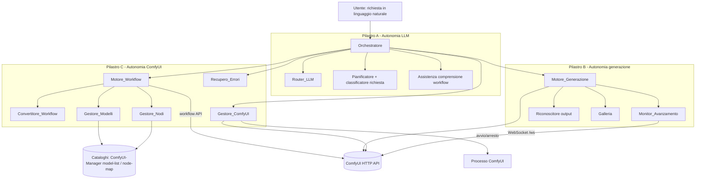
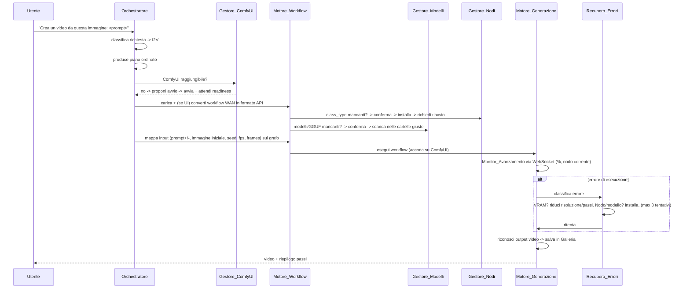

# Design Document

## Overview

Questo documento descrive il design per rendere **MGCoding completamente autonoma** sui tre pilastri definiti nei requisiti: autonomia LLM (ciclo agentico di generazione), autonomia di generazione (immagini + video T2V/I2V) e autonomia ComfyUI (ciclo di vita, conversione workflow, modelli/nodi, recupero errori).

Il design **estende l'estensione `mgcoding` esistente** (`extensions/mgcoding/src/`) riusando i componenti già presenti invece di reinventarli:

- `media/comfyHelper.ts` — già contiene download modelli, `runWorkflow`, `injectPrompt`, `missingNodes`, `missingModels`, `installMissingNodesForWorkflow`, `installMissingModelsForWorkflow`.
- `media/imageGen.ts` — già contiene `detectImageBackend`, `generateImage`, `queueAndCollect` (accodamento job ComfyUI via `/prompt` + polling `/history`).
- `media/imageStudioView.ts` — webview Image Studio (stato ComfyUI, galleria).
- `media/comfyCanvas.ts` — apertura canvas ComfyUI.
- `agent/agentLoop.ts` — loop agentico ReAct con piano, tool, sub-agent, auto-verifica.
- `llm/registry.ts` — `ProviderRegistry` con routing (`pickProvider`, `autoRoute`), AutoModel, vision, chiavi cloud.

La strategia è **introdurre un livello di orchestrazione e di workflow robusto** sopra questi elementi, trasformando le attuali funzioni "best-effort guidate dalla UI" in un **pipeline deterministico e testabile** (`Orchestratore → piano → Motore_Workflow → ComfyUI`), con recupero errori automatico.

Lo scenario guida è **WAN 2.2 I2V GGUF**: workflow multi-stadio (esperti high-noise/low-noise), doppio LoRA, pesi GGUF, su GPU da 8 GB. Il design tratta esplicitamente conversione UI→API, mappatura input via grafo, GGUF come modelli da risolvere, e degrado a bassa VRAM.

### Principi di design

1. **Logica pura separata dall'I/O.** Tutte le trasformazioni di workflow (conversione, mappatura input, rilevamento dipendenze, classificazione output/errori, selezione parametri) sono **funzioni pure** su strutture dati JSON, in moduli senza dipendenze da `vscode`/`fetch`. L'I/O (HTTP a ComfyUI, processi, download, dialog) vive in adapter sottili. Questo rende la logica core **testabile con property-based testing**.
2. **Local-first e conferma per azioni rischiose.** Riuso del pattern esistente di conferme modali per clonazione nodi/download/avvio processi.
3. **Estensione, non riscrittura.** I moduli nuovi affiancano quelli esistenti; le firme pubbliche già usate (`runWorkflow`, `queueAndCollect`) restano compatibili.
4. **Windows come piattaforma di riferimento**, con astrazione dei percorsi e del lancio processi.

## Architecture

### Vista dei componenti

I componenti seguono il glossario dei requisiti. I nuovi moduli vivono sotto `extensions/mgcoding/src/media/` (livello generazione/ComfyUI) e `extensions/mgcoding/src/agent/` (orchestrazione).



### Flusso end-to-end (scenario WAN 2.2 I2V)



### Mappa moduli (nuovi e modificati)

| Modulo | Tipo | Responsabilità | Requisiti |
|---|---|---|---|
| `agent/genOrchestrator.ts` | nuovo | Ciclo agentico di generazione: classifica, pianifica, esegue, riporta | 1, 4 |
| `media/requestClassifier.ts` | nuovo (puro) | Classifica richiesta in `image`/`t2v`/`i2v`; rileva ambiguità | 1.1, 1.6 |
| `media/workflowGraph.ts` | nuovo (puro) | Modello grafo workflow API: link, risoluzione nodo-sorgente di un input | 3, 9, 10 |
| `media/workflowMapping.ts` | nuovo (puro) | Mappa parametri logici → nodi/campi; inietta prompt/seed/immagine/durata/fps | 3, 5.3, 9, 10 |
| `media/workflowConverter.ts` | nuovo (puro + adapter) | Conversione UI→API (locale; fallback ComfyUI); estrazione da archivio | 15 |
| `media/modelRefs.ts` | nuovo (puro) | Estrae riferimenti modello (incl. GGUF) con cartella di destinazione | 9.1, 16.1, 19.3 |
| `media/nodeRefs.ts` | nuovo (puro) | Estrae `class_type` usate; calcola mancanti dato l'insieme noto | 17.1 |
| `media/errorClassifier.ts` | nuovo (puro) | Classifica errori ComfyUI; pianifica azione correttiva; budget tentativi | 18 |
| `media/outputClassifier.ts` | nuovo (puro) | Classifica output di esecuzione in video/immagine | 6 |
| `media/vramProfile.ts` | nuovo (puro) | Parametri predefiniti e riduzioni progressive per limite VRAM | 19 |
| `media/comfyLifecycle.ts` | nuovo (adapter) | Rilevamento, avvio, arresto, readiness, Python embedded | 12, 13, 14, 24 |
| `media/progressMonitor.ts` | nuovo (adapter) | WebSocket di stato + fallback polling | 8 |
| `media/videoGen.ts` | nuovo (adapter) | Esecuzione workflow video; recupero file video | 5, 6 |
| `media/comfyHelper.ts` | modificato | Riusa `modelRefs`/`nodeRefs`; download/installazione | 16, 17 |
| `media/imageGen.ts` | modificato | Backend selection per video; riuso `queueAndCollect` | 11 |
| `media/imageStudioView.ts` | modificato | Galleria immagini+video, anteprima, elimina, apri | 7 |
| `llm/registry.ts` | modificato | `pickProvider` con vision/local-first per generazione | 2, 20 |

## Components and Interfaces

### Orchestratore (`agent/genOrchestrator.ts`)

Coordina il ciclo agentico di generazione. Riusa `runAgent`/`AgentCallbacks` di `agentLoop.ts` per il dialogo e `ProviderRegistry` per il routing.

```typescript
export type GenKind = 'image' | 't2v' | 'i2v';

export interface GenRequest {
	prompt: string;
	/** Immagine iniziale in base64 (senza prefisso data:), se presente. */
	initImage?: string;
	/** Tipo forzato dall'utente; se assente lo classifica l'Orchestratore. */
	forcedKind?: GenKind;
	seed?: number;          // >=0 = fisso; assente/-1 = casuale
	frames?: number;        // durata video
	fps?: number;
	aspect?: string;
}

export interface PlanStepGen {
	kind: 'select-workflow' | 'check-deps' | 'set-inputs' | 'execute' | 'report';
	description: string;
}

export interface GenOutcome {
	status: 'success' | 'failed' | 'cancelled' | 'needs-confirmation';
	media: GeneratedItem[];
	stepsExecuted: PlanStepGen[];
	failedStep?: PlanStepGen;
	cause?: string;         // in linguaggio naturale
}

export interface IOrchestrator {
	/** Classifica la richiesta. Restituisce 'ambiguous' se il tipo non è determinabile. */
	classify(req: GenRequest): GenKind | 'ambiguous';
	/** Produce il piano ordinato per un tipo di richiesta. */
	plan(kind: GenKind): PlanStepGen[];
	/** Esegue il piano fino a completamento o primo errore non recuperabile. */
	run(req: GenRequest, cb: AgentCallbacks, signal?: AbortSignal): Promise<GenOutcome>;
}
```

Il piano (`plan`) garantisce sempre l'ordine canonico: `select-workflow → check-deps → set-inputs → execute → report` (Req. 1.2). `classify` usa `requestClassifier` (logica pura) e, in caso di ambiguità, l'Orchestratore chiede conferma all'utente via `cb.onAsk` (Req. 1.6).

### Router_LLM (estensione di `ProviderRegistry`)

Si aggiunge un metodo dedicato alla selezione per i compiti di generazione, riusando `pickProvider`, `autoRoute`, vision e local-first già esistenti.

```typescript
export interface RouteContext {
	hint?: string;
	hasImages: boolean;
	complexity: 'light' | 'heavy';
	localFirst: boolean;
}

export interface ILLMRouter {
	/** Sceglie provider raggiungibile; vision se hasImages; locale se localFirst. */
	selectProvider(ctx: RouteContext): Promise<LLMProvider | undefined>;
}
```

Se nessun provider è configurato/raggiungibile, restituisce `undefined` e l'Orchestratore notifica l'utente con le istruzioni di configurazione (Req. 2.4).

### Motore_Workflow (`media/workflowGraph.ts`, `workflowMapping.ts`)

Cuore della robustezza. Modella il workflow API come grafo e risolve i nodi tramite i link.

```typescript
/** Nodo di un workflow in formato API. */
export interface ApiNode {
	class_type: string;
	inputs: Record<string, WorkflowValue>;
	_meta?: { title?: string };
}
/** Un input è un valore scalare o un link [nodeId, slotIndex]. */
export type WorkflowValue = string | number | boolean | null | [string, number] | WorkflowValue[];
export type ApiWorkflow = Record<string, ApiNode>;

/** Parametri logici indipendenti dal workflow concreto. */
export interface LogicalParams {
	positivePrompt?: string;
	negativePrompt?: string;
	seed?: number;          // assente => casuale
	steps?: number;
	cfg?: number;
	width?: number;
	height?: number;
	initImageRef?: string;  // nome file caricato su ComfyUI
	frames?: number;
	fps?: number;
}

/** Mappatura risolta parametro logico → (nodeId, campo). */
export type ParamMapping = Partial<Record<keyof LogicalParams, { nodeId: string; field: string }[]>>;
```

Funzioni pure principali:

```typescript
// workflowGraph.ts
export function isApiFormat(obj: unknown): obj is ApiWorkflow;
export function isLink(v: WorkflowValue): v is [string, number];
/** Segue il link di un input fino al nodo sorgente (id). */
export function resolveSource(wf: ApiWorkflow, nodeId: string, field: string): string | undefined;
/** Trova i nodi sampler (class_type ~ KSampler/Sampler/...). */
export function findSamplers(wf: ApiWorkflow): string[];
/** Risale dall'input 'positive'/'negative' di un sampler al nodo di testo (CLIPTextEncode). */
export function resolveConditioningTextNode(wf: ApiWorkflow, samplerId: string, slot: 'positive' | 'negative'): string | undefined;

// workflowMapping.ts
export function buildMapping(wf: ApiWorkflow): ParamMapping;          // Req 3.1
export function applyParams(wf: ApiWorkflow, params: LogicalParams, mapping: ParamMapping): ApiWorkflow; // Req 9, 10, 5.3
export function unmappedParams(required: (keyof LogicalParams)[], mapping: ParamMapping): (keyof LogicalParams)[]; // Req 3.4
```

`applyParams` è **immutabile** (clona, non muta l'input), inietta il prompt **solo** nel nodo di testo risolto via link del sampler (Req. 10.1/10.2), applica il seed a **tutti** i nodi con campo seed (`seed`/`noise_seed`) in modo coerente tra gli stadi (Req. 9.2, 10.4/10.5), preserva i link dei LoRA (Req. 9.3) e applica `frames`/`fps` ai campi corrispondenti dei nodi video (Req. 5.3).

### Convertitore_Workflow (`media/workflowConverter.ts`)

```typescript
export interface UiWorkflow {
	nodes: { id: number | string; type: string; widgets_values?: unknown[]; inputs?: unknown[]; outputs?: unknown[] }[];
	links: [number, number, number, number, number, string][];
}
export type ConversionResult =
	| { ok: true; api: ApiWorkflow }
	| { ok: false; reason: string };

/** Conversione LOCALE pura UI->API (deterministica). */
export function convertUiToApi(ui: UiWorkflow, objectInfo: ObjectInfo): ConversionResult; // Req 15.2
/** Vero se il JSON è formato UI (nodes[]+links[]) e non API. */
export function isUiFormat(obj: unknown): obj is UiWorkflow;
```

La conversione locale usa `objectInfo` (da `/object_info`) per ordinare i `widgets_values` nei nomi di input corretti. Se la conversione locale non è possibile e ComfyUI è raggiungibile, un adapter usa l'endpoint ComfyUI per produrre il formato API (Req. 15.3); se neppure questo è possibile, restituisce `{ ok: false, reason }` (Req. 15.4). L'estrazione da archivio (zip) avviene in un adapter prima della conversione (Req. 15.5).

### Gestore_Modelli e Gestore_Nodi (`media/modelRefs.ts`, `nodeRefs.ts`)

Logica pura di rilevamento (gli adapter di download/clone restano in `comfyHelper.ts`).

```typescript
// modelRefs.ts
export interface ModelRef { filename: string; dir: string; viaGguf: boolean; }
export function referencedModels(wf: ApiWorkflow): ModelRef[];        // Req 9.1, 16.1
export function keyToModelDir(field: string): string;                  // cartella per tipo
export function missingModels(refs: ModelRef[], available: Set<string>): ModelRef[]; // Req 16.1

// nodeRefs.ts
export function usedClassTypes(wf: ApiWorkflow): string[];             // Req 17.1
export function missingNodes(used: string[], known: Set<string>): string[]; // Req 17.1
```

I campi GGUF (`unet_name`, `gguf_name`, ecc. con estensione `.gguf`) sono trattati come riferimenti a modelli da verificare/scaricare con `viaGguf: true` (Req. 9.1, 19.3).

### Recupero_Errori (`media/errorClassifier.ts`)

```typescript
export type ErrorCause = 'missing-node' | 'missing-model' | 'oom-vram' | 'unknown';

export interface ClassifiedError {
	cause: ErrorCause;
	detail: string;
	subject?: string;       // nome nodo/modello coinvolto, se estraibile
}
export interface RecoveryAction {
	kind: 'install-node' | 'download-model' | 'reduce-memory' | 'give-up';
	requiresConfirmation: boolean;
}

export function classifyError(message: string): ClassifiedError;       // Req 18.1
/** Decide l'azione dato l'errore e il numero di tentativi già usati (cap a 3). */
export function planRecovery(err: ClassifiedError, attempt: number): RecoveryAction; // Req 18.2-18.6
export const MAX_RETRIES = 3;
```

### Monitor_Avanzamento (`media/progressMonitor.ts`)

Si connette al WebSocket di ComfyUI (`/ws?clientId=...`) per ricevere gli eventi `progress` (valore/massimo) ed `executing` (nodo corrente). In caso di caduta, l'adapter ripiega sul polling di `/history/{promptId}` e `/queue` (Req. 8.4). L'annullamento invoca `/interrupt` (Req. 8.2).

```typescript
export interface ProgressUpdate { percent: number; currentNode?: string; }
export interface IProgressMonitor {
	onUpdate(cb: (u: ProgressUpdate) => void): vscode.Disposable;
	/** true = via WebSocket, false = fallback polling. */
	readonly live: boolean;
}
```

### Motore_Generazione (`media/videoGen.ts`, `imageGen.ts`) e Galleria

`videoGen.ts` esegue i workflow video riusando `queueAndCollect` (esteso per raccogliere anche output video da `/history`), recupera i file video dai nodi di output e li passa alla Galleria. `outputClassifier.ts` (puro) classifica gli output. La Galleria (`imageStudioView.ts`) elenca immagini+video, riproduce i video in anteprima `<video>`, elimina e apre i file.

## Data Models

### Workflow API (riuso del formato ComfyUI)

```typescript
type ApiWorkflow = Record<NodeId, ApiNode>;        // NodeId = string
interface ApiNode { class_type: string; inputs: Record<string, WorkflowValue>; _meta?: { title?: string }; }
type WorkflowValue = string | number | boolean | null | [NodeId, number] | WorkflowValue[];
```

Un input è **un link** quando è la tupla `[nodeId, slotIndex]` (riferimento all'output di un altro nodo), altrimenti è un **valore letterale** (testo, seed, nome file). Questa distinzione è la base della mappatura robusta.

### Mappatura risolta (persistita per riuso)

```typescript
interface SavedWorkflowMapping {
	workflowHash: string;            // hash della struttura del grafo
	mapping: ParamMapping;
	resolvedAt: string;              // ISO
}
```

Salvata in `.mg/workflows/.mappings/{name}.json` per riusare la mappatura su esecuzioni successive (Req. 3.3).

### Elemento generato (Galleria)

```typescript
type MediaKind = 'image' | 'video';
interface GeneratedItem {
	uri: string;
	kind: MediaKind;
	format: string;                  // png, webp, mp4, gif...
	createdAt: string;
	sourcePrompt?: string;
}
```

### Profilo VRAM

```typescript
interface VramProfile { limitGB: number; }
interface GenParams { steps: number; cfg: number; width: number; height: number; frames?: number; }
/** Livelli di riduzione progressiva applicati dal Recupero_Errori. */
type MemoryTier = 0 | 1 | 2 | 3;   // 0 = predefinito, 3 = minimo consumo
```

### Catalogo modelli

Riuso di `ModelCatalogEntry` esistente e dei cataloghi remoti di ComfyUI-Manager (`model-list.json`, `extension-node-map.json`) già usati in `comfyHelper.ts`.

## Correctness Properties

*Una proprietà è una caratteristica o un comportamento che deve valere per tutte le esecuzioni valide del sistema — in sostanza, un'affermazione formale su cosa il sistema deve fare. Le proprietà fanno da ponte tra le specifiche leggibili dall'uomo e le garanzie di correttezza verificabili dalla macchina.*

Le proprietà seguenti coprono la **logica pura** del sistema (trasformazioni di workflow, mappatura input, rilevamento dipendenze, classificazione output/errori, selezione parametri/provider, costruzione percorsi). Le parti di I/O (avvio processi, download, WebSocket, conferme UI) sono coperte dalla strategia di test con esempi e integrazione descritta più sotto. Le proprietà ridondanti individuate nella prework sono state consolidate.

### Property 1: Classificazione I2V con immagine iniziale

*Per ogni* richiesta di generazione che fornisce un'immagine iniziale e contiene un intento video, `classify` restituisce sempre `i2v`; per ogni richiesta con intento video ma senza immagine restituisce `t2v`; e il risultato è sempre uno tra `image`, `t2v`, `i2v`, `ambiguous`.

**Validates: Requirements 1.1**

### Property 2: Richiesta senza marcatori di tipo è ambigua

*Per ogni* richiesta priva di immagine iniziale e priva di qualsiasi marcatore di tipo (immagine/video), `classify` restituisce `ambiguous`.

**Validates: Requirements 1.6**

### Property 3: Il piano contiene le fasi richieste in ordine canonico

*Per ogni* tipo di generazione, il piano prodotto da `plan` contiene le fasi `select-workflow`, `check-deps`, `set-inputs`, `execute` e i loro indici sono in ordine strettamente crescente in quell'ordine.

**Validates: Requirements 1.2**

### Property 4: Selezione provider LLM dall'insieme dei disponibili con local-first

*Per ogni* insieme di provider con disponibilità e località arbitrarie, `selectProvider` restituisce un provider appartenente all'insieme dei disponibili (o `undefined` se vuoto); e quando `localFirst` è attivo ed esiste almeno un provider locale disponibile, la scelta è locale.

**Validates: Requirements 2.1, 2.5, 20.1**

### Property 5: Auto-route instrada per complessità

*Per ogni* richiesta marcata come complessa l'auto-route seleziona il provider designato "heavy", e per ogni richiesta marcata come semplice seleziona quello "light".

**Validates: Requirements 2.2**

### Property 6: Con immagini si sceglie un modello vision quando disponibile

*Per ogni* lista di modelli installati e richiesta che include immagini, se almeno un modello dichiara capacità vision allora il modello selezionato ha capacità vision.

**Validates: Requirements 2.3**

### Property 7: La mappatura risolta referenzia solo nodi e campi esistenti

*Per ogni* workflow in formato API, ogni voce prodotta da `buildMapping` punta a una coppia `(nodeId, field)` in cui `nodeId` esiste nel workflow e `field` esiste tra gli input di quel nodo.

**Validates: Requirements 3.1**

### Property 8: Round-trip di persistenza della mappatura

*Per ogni* `ParamMapping`, serializzarla e poi deserializzarla produce una mappatura uguale all'originale.

**Validates: Requirements 3.3**

### Property 9: I parametri non mappabili sono esattamente la differenza insiemistica

*Per ogni* insieme di parametri logici richiesti e ogni mappatura, `unmappedParams` restituisce esattamente i parametri richiesti che non compaiono come chiavi nella mappatura (né più né meno).

**Validates: Requirements 3.4**

### Property 10: Il workflow proposto supporta il tipo richiesto

*Per ogni* elenco di workflow locali con le rispettive capacità e ogni tipo richiesto, se viene proposto un workflow allora quel workflow supporta il tipo richiesto; se nessun workflow supporta il tipo, non viene proposto alcun workflow.

**Validates: Requirements 4.1**

### Property 11: Le dipendenze indicate per un workflow coincidono con i suoi riferimenti

*Per ogni* workflow in formato API, l'insieme di modelli e nodi indicati come richiesti coincide con `referencedModels` e `usedClassTypes` del workflow.

**Validates: Requirements 4.3**

### Property 12: L'immagine iniziale è instradata al nodo di caricamento immagine

*Per ogni* workflow contenente un nodo di caricamento immagine usato come ingresso e ogni riferimento di immagine iniziale, dopo `applyParams` il campo immagine di quel nodo è impostato esattamente al riferimento fornito.

**Validates: Requirements 5.2, 10.3**

### Property 13: Durata e fps sono applicati ai campi corrispondenti

*Per ogni* workflow video che espone campi di durata (frames) e fps e ogni coppia di valori, dopo `applyParams` quei campi assumono esattamente i valori richiesti.

**Validates: Requirements 5.3**

### Property 14: Coerenza tra rilevazione "produce video" e presenza di nodi di output video

*Per ogni* workflow, la rilevazione "produce video" è vera se e solo se il workflow contiene almeno un nodo di output video.

**Validates: Requirements 5.5**

### Property 15: Classificazione degli output in video/immagine

*Per ogni* descrittore di output di esecuzione, l'output è classificato come video se e solo se proviene da un nodo di combinazione video o è un formato animato (WEBP/GIF animato, mp4, ecc.); altrimenti è classificato come immagine.

**Validates: Requirements 6.1, 6.2**

### Property 16: Il salvataggio preserva il formato originale del video

*Per ogni* file video recuperato, il percorso di destinazione nella Galleria mantiene la stessa estensione/formato del file di origine.

**Validates: Requirements 6.3**

### Property 17: Partizionamento totale di output ed elenchi in immagini e video

*Per ogni* insieme di elementi (output di esecuzione o file di una cartella), il partizionamento in immagini e video copre tutti gli elementi con estensione/descrittore di media noto, senza perdite né duplicazioni, e ogni elemento è assegnato alla categoria coerente con la sua estensione/descrittore.

**Validates: Requirements 6.4, 7.1**

### Property 18: Gli eventi di avanzamento mappano a stati validi

*Per ogni* evento di avanzamento ricevuto, l'aggiornamento prodotto ha `percent` nell'intervallo `[0, 100]`; e per ogni evento di esecuzione di un nodo, `currentNode` è valorizzato col nodo indicato dall'evento.

**Validates: Requirements 8.1**

### Property 19: I file GGUF sono riferimenti di modello da risolvere

*Per ogni* workflow che usa campi nome-modello con estensione `.gguf`, ogni file `.gguf` compare in `referencedModels` con `viaGguf` vero.

**Validates: Requirements 9.1**

### Property 20: Seed fisso applicato in modo coerente a tutti gli stadi

*Per ogni* workflow multi-stadio e ogni seed fisso, dopo `applyParams` tutti i nodi che espongono un campo seed (`seed`/`noise_seed`) hanno esattamente quel valore.

**Validates: Requirements 9.2, 10.4**

### Property 21: I collegamenti dei LoRA sono preservati

*Per ogni* workflow contenente nodi LoRA e ogni insieme di parametri, dopo `applyParams` tutti gli input che sono collegamenti (tuple `[nodeId, slot]`) restano identici a prima dell'applicazione.

**Validates: Requirements 9.3**

### Property 22: Il prompt è iniettato solo nel nodo di testo risolto via link del sampler

*Per ogni* workflow con uno o più nodi di testo e ogni prompt positivo/negativo, dopo `applyParams` cambia il testo del solo nodo risolto seguendo il link `positive`/`negative` del sampler, mentre il testo di tutti gli altri nodi resta invariato.

**Validates: Requirements 9.4, 10.1, 10.2**

### Property 23: Seed casuale impostato su tutti i campi seed entro il range

*Per ogni* workflow, applicando i parametri senza seed fisso, ogni nodo che espone un campo seed riceve un intero non negativo entro il range consentito e nessun campo seed resta non impostato.

**Validates: Requirements 10.5**

### Property 24: Selezione automatica del backend di generazione disponibile

*Per ogni* insieme di backend con disponibilità e priorità, quando nessun backend è forzato la scelta è il primo backend disponibile secondo l'ordine di priorità, e appartiene sempre all'insieme dei disponibili.

**Validates: Requirements 11.1**

### Property 25: La generazione video sceglie un backend con capacità video

*Per ogni* insieme di backend disponibili e ogni richiesta video, se viene selezionato un backend allora quel backend supporta i workflow video.

**Validates: Requirements 11.2**

### Property 26: Conversione UI→API che preserva nodi e topologia (round-trip)

*Per ogni* workflow in formato API valido, costruendo una rappresentazione UI equivalente e riconvertendola con `convertUiToApi`, il risultato è un workflow API equivalente: stesso insieme di `class_type` e stessa topologia dei collegamenti tra nodi.

**Validates: Requirements 15.2**

### Property 27: I modelli mancanti sono la differenza tra referenziati e disponibili

*Per ogni* insieme di modelli referenziati da un workflow e ogni insieme di modelli disponibili, `missingModels` restituisce esattamente i referenziati che non sono disponibili.

**Validates: Requirements 16.1**

### Property 28: La cartella di destinazione è dedotta correttamente dal tipo di campo

*Per ogni* nome di campo modello (es. `ckpt_name`, `vae_name`, `lora_name`, `unet_name`, `clip_name`, `control_net_name`, campi GGUF), `keyToModelDir` restituisce la cartella di modelli attesa per quel tipo.

**Validates: Requirements 16.2**

### Property 29: I nodi mancanti sono la differenza tra usati e noti

*Per ogni* insieme di `class_type` usate da un workflow e ogni insieme di `class_type` note a ComfyUI, `missingNodes` restituisce esattamente le usate che non sono note.

**Validates: Requirements 17.1**

### Property 30: Classificazione degli errori di esecuzione

*Per ogni* messaggio di errore, `classifyError` restituisce sempre una causa tra `missing-node`, `missing-model`, `oom-vram`, `unknown`; e per messaggi contenenti i marcatori caratteristici di una categoria (memoria insufficiente, nodo non trovato, file modello non trovato) restituisce la categoria corrispondente.

**Validates: Requirements 18.1**

### Property 31: L'azione di recupero corrisponde alla causa

*Per ogni* errore classificato come `missing-node` l'azione di recupero è `install-node` con conferma richiesta, e per ogni errore `missing-model` l'azione è `download-model` con conferma richiesta.

**Validates: Requirements 18.2, 18.3**

### Property 32: La riduzione di memoria non aumenta i parametri e rispetta il minimo

*Per ogni* configurazione di parametri e ogni livello di riduzione, i parametri ridotti hanno `steps`, `width`, `height` non maggiori dei correnti e non inferiori ai minimi consentiti.

**Validates: Requirements 18.4, 19.2**

### Property 33: Budget di ritentativi limitato a 3

*Per ogni* errore e ogni numero di tentativi già effettuati, se la causa è `unknown` oppure i tentativi hanno raggiunto `MAX_RETRIES` (3) allora l'azione pianificata è `give-up`; di conseguenza il numero di ritentativi non supera mai 3.

**Validates: Requirements 18.5, 18.6**

### Property 34: I parametri predefiniti rispettano il limite di VRAM

*Per ogni* limite di VRAM minore o uguale a 8 GB, i parametri predefiniti prodotti da `defaultParams` stanno entro le soglie compatibili definite per quel limite.

**Validates: Requirements 19.1**

### Property 35: A bassa VRAM si preferisce la variante GGUF quando disponibile

*Per ogni* modello richiesto con limite di VRAM basso, se è disponibile una variante quantizzata GGUF allora la variante proposta è quella GGUF.

**Validates: Requirements 19.3**

### Property 36: I prompt sono esclusi dalla telemetria

*Per ogni* prompt, l'evento di telemetria costruito non contiene il testo del prompt in alcun campo serializzato.

**Validates: Requirements 21.3**

### Property 37: Il degrado disabilita solo le funzioni dipendenti da ComfyUI

*Per ogni* stato di disponibilità di ComfyUI, quando ComfyUI non è disponibile l'insieme delle funzioni abilitate esclude esattamente quelle che dipendono da ComfyUI e mantiene tutte le altre.

**Validates: Requirements 23.1**

### Property 38: Il comando di avvio su Windows usa l'invocazione attesa

*Per ogni* layout di installazione su piattaforma Windows, il comando di avvio costruito usa l'interprete/eseguibile e gli argomenti attesi per quella piattaforma.

**Validates: Requirements 24.2**

### Property 39: La costruzione dei percorsi usa separatori coerenti con l'OS

*Per ogni* sequenza di segmenti di percorso, il percorso costruito usa il separatore dell'OS corrente in modo coerente, senza mischiare separatori.

**Validates: Requirements 24.3**

## Error Handling

Il design tratta gli errori in modo strutturato attraverso il `Recupero_Errori`, con messaggi sempre tradotti in linguaggio naturale per l'utente.

### Categorie di errore e strategia

| Categoria | Rilevamento | Azione | Requisito |
|---|---|---|---|
| ComfyUI non raggiungibile | probe `/system_stats` con timeout 3s | stato non disponibile + proposta avvio; degrado controllato delle funzioni dipendenti | 12.2, 23.1 |
| Mancato avvio | endpoint non pronto entro 120s | segnala mancato avvio, lascia il sistema utilizzabile | 13.5 |
| Workflow non convertibile | `convertUiToApi` → `{ok:false,reason}` | segnala motivo; offre fallback ComfyUI se raggiungibile | 15.3, 15.4 |
| Nodo custom mancante | `classifyError` → `missing-node` | propone installazione (conferma) e ritenta | 18.2 |
| Modello mancante | `classifyError` → `missing-model` | propone download (conferma) e ritenta; alternativa o GGUF | 18.3, 19.3, 23.2 |
| VRAM insufficiente | `classifyError` → `oom-vram` | applica tier di memoria inferiore e ritenta | 18.4, 19.2 |
| Errore sconosciuto / tentativi esauriti | `classifyError` → `unknown` o `attempt≥3` | riporta errore + azione suggerita in linguaggio naturale | 18.5, 18.6 |
| Download fallito | eccezione su streaming | riporta modello e causa | 16.5 |
| Installazione ComfyUI fallita | eccezione install | riporta causa, stato utilizzabile | 14.4 |

### Principi

- **Budget di ritentativi**: massimo 3 (`MAX_RETRIES`), enforced in `planRecovery` (Property 33).
- **Recupero idempotente**: ogni ritentativo riparte dallo stesso piano con parametri/dipendenze aggiornati, senza accumulare effetti collaterali.
- **Conferma per azioni rischiose**: clonazione nodi, download, avvio/installazione processi ed eliminazione file richiedono sempre conferma esplicita (Req. 22), riusando i dialog modali esistenti.
- **Degrado controllato**: in assenza di ComfyUI o di un modello, le funzioni indipendenti restano attive e l'utente riceve indicazioni su cosa installare (Req. 23).
- **Offline/local-first**: le operazioni che richiedono rete in assenza di connessione vengono segnalate; la generazione con risorse locali resta possibile (Req. 20).

## Testing Strategy

Il progetto usa attualmente un runner di test leggero (`extensions/mgcoding/src/test/*.test.ts` eseguiti con `node out/test/*.test.js`) per funzioni pure. La strategia adotta un **approccio duale**: property-based testing per la logica pura universale, test a esempi/integrazione per l'I/O.

### Libreria di property-based testing

- Si adotta **`fast-check`** (standard de-facto per TypeScript/JavaScript), come dipendenza di sviluppo dell'estensione. Non si implementa il PBT da zero.
- Ogni proprietà del documento è implementata con **un singolo test di proprietà**.
- Ogni test di proprietà esegue **almeno 100 iterazioni** (`fc.assert(..., { numRuns: 100 })`).
- Ogni test è annotato con un commento che referenzia la proprietà di design, nel formato:
  `// Feature: comfyui-autonomy, Property {numero}: {testo della proprietà}`
- I generatori coprono esplicitamente gli edge case rilevati nella prework: workflow vuoti, multi-sampler, link concatenati di LoRA, campi GGUF, formati video webp/gif/mp4, prompt con caratteri speciali/non-ASCII, percorsi con segmenti vari.

### Organizzazione dei test di proprietà

I test di proprietà vivono accanto ai moduli puri, in `extensions/mgcoding/src/test/`:

| File di test | Moduli sotto test | Proprietà |
|---|---|---|
| `requestClassifier.pbt.test.ts` | `requestClassifier` | 1, 2 |
| `genPlan.pbt.test.ts` | `genOrchestrator.plan` | 3 |
| `router.pbt.test.ts` | router LLM / backend selection | 4, 5, 6, 24, 25 |
| `workflowMapping.pbt.test.ts` | `workflowGraph`, `workflowMapping` | 7, 8, 9, 12, 13, 20, 21, 22, 23 |
| `outputClassifier.pbt.test.ts` | `outputClassifier` | 14, 15, 16, 17 |
| `progressMonitor.pbt.test.ts` | parsing eventi (puro) | 18 |
| `modelRefs.pbt.test.ts` | `modelRefs` | 11, 19, 27, 28, 35 |
| `nodeRefs.pbt.test.ts` | `nodeRefs` | 11, 29 |
| `workflowConverter.pbt.test.ts` | `workflowConverter` | 26 |
| `errorClassifier.pbt.test.ts` | `errorClassifier`, `vramProfile` | 30, 31, 32, 33, 34 |
| `degradation.pbt.test.ts` | capability gating | 37 |
| `telemetry.pbt.test.ts` | costruzione evento telemetria | 36 |
| `paths.pbt.test.ts` | `util/paths`, comando avvio | 38, 39 |
| `workflowProposal.pbt.test.ts` | scoperta workflow | 10 |

### Test a esempi e di integrazione

Coprono le aree non adatte al PBT (identificate nella prework come EXAMPLE/EDGE_CASE):

- **Orchestrazione** (1.3, 1.4, 1.5): esecuzione del piano con orchestratore e adapter mockati (percorso felice, stop su errore non recuperabile, outcome con passi/causa).
- **Disambiguazione LLM** (3.2): LLM mock che restituisce una scelta; verifica adozione.
- **Ciclo di vita ComfyUI** (12.1, 12.2, 12.3, 13.x, 14.x): mock di `fetch`/spawn per probe, readiness, avvio/arresto, installazione, con verifica dei timeout (3s, 120s) e delle conferme.
- **Conversione fallback** (15.1, 15.3, 15.5): import API, fallback ComfyUI, estrazione archivio.
- **Download e installazione** (16.3, 16.4, 16.5, 17.2, 17.3, 17.4, 17.5): mock di download/exec con conferme, progresso, annullamento, gestione errori.
- **Avanzamento/annullamento** (8.2, 8.3, 8.4): mock WebSocket/`/interrupt` con verifica del fallback al polling.
- **Galleria UI** (7.2, 7.3, 7.4): render `<video>`, eliminazione con conferma, apertura nel SO.
- **Privacy** (21.1, 21.2): spy di rete per verificare che il prompt non raggiunga host non selezionati.
- **Degrado/conferme** (22.x, 23.2, 23.3, 20.2, 20.3): verifica delle conferme e dei messaggi.

### Bilanciamento

- I test di proprietà coprono la correttezza universale della logica di trasformazione (il cuore della robustezza del sistema).
- I test a esempi coprono punti di integrazione, edge case specifici e condizioni di errore.
- Si evita di moltiplicare i test a esempi dove una proprietà già copre l'intero spazio di input.

### Validazione TypeScript

Come da linee guida del progetto: dopo le modifiche sotto `extensions/`, compilare con il task di build delle estensioni (o `npm run gulp compile-extensions`) e correggere ogni errore di compilazione prima di eseguire i test. Eseguire i test di proprietà in modalità singola (non watch).
