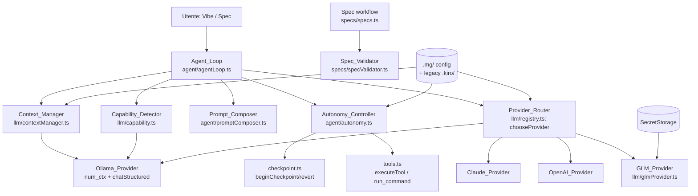
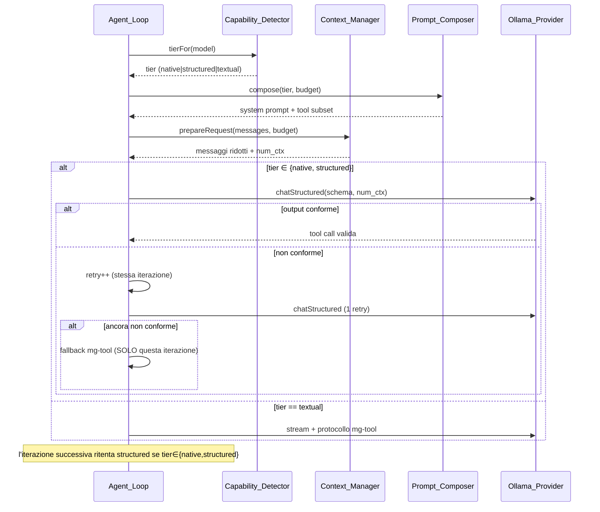

# Design: local-model-kiro-parity

## Overview

Questa funzionalità porta le esperienze **Vibe** (chat agentica) e **Spec** (workflow requirements → design → tasks) di MGCoding a un livello di affidabilità paragonabile a Kiro **quando l'agente gira su modelli locali** (Ollama), con i modelli cloud economici (GLM) come ripiego conveniente.

Il design interviene su sette aree del livello LLM/agente già esistente (`extensions/mgcoding/src/`), aggiungendo componenti puri e testabili attorno all'infrastruttura attuale senza romperne la retrocompatibilità:

1. **Context_Manager** — calcola il budget di token, imposta `num_ctx` su Ollama (oggi mai impostato) e riassume/tronca la cronologia in modo consapevole dei token (Req. 1, 4).
2. **Capability_Detector** — classifica ogni modello in un `Capability_Tier` (`native` / `structured` / `textual`) tramite un test funzionale, non fidandosi della sola capability `tools` dichiarata da `/api/show` (Req. 3, 9.6).
3. **Structured-first tool-calling** — rende lo `Structured_Tool_Engine` il default per i modelli capaci, con retry **per iterazione** e fallback testuale `mg-tool` limitato alla singola iterazione (Req. 2).
4. **Autonomy_Controller** — formalizza le modalità `autopilot` e `supervised` sopra l'infrastruttura di checkpoint esistente, con gating delle azioni a rischio (Req. 5).
5. **Spec_Validator** — verifica copertura EARS → task, struttura dei documenti e gating dell'approvazione (Req. 6).
6. **Prompt_Composer** — seleziona variante di system prompt e sottoinsieme di tool in base a `Capability_Tier` e `Context_Budget` (Req. 7).
7. **GLM_Provider** + routing di costo — aggiunge il provider GLM (OpenAI-compatibile e Anthropic-compatibile) e lo integra nell'instradamento heavy/light con politica local-first e ripieghi (Req. 8, 9, 10).

Attraversa tutto: Windows-first (`win32`, shell `cmd`), identificatori di codice in inglese e prosa in italiano, configurazione scritta sotto `.mg/` con lettura legacy `.kiro/`, chiavi provider in VS Code SecretStorage, e default che preservano il comportamento per gli utenti esistenti (Req. 11).

### Principio di design trasversale: nucleo puro, guscio I/O

Ogni componente è diviso in:
- una **funzione/logica pura** (nessuna dipendenza da `vscode`, da `fetch` o dal filesystem), che concentra le decisioni (budget, tier, routing, validazione, scelta variante) ed è verificabile con property-based testing;
- un **guscio** (la classe/provider esistente) che fa I/O e delega le decisioni al nucleo puro.

Questo segue il pattern già adottato da `chooseProvider` in `llm/registry.ts`, che è una funzione pura testata in `test/router.pbt.test.ts`.

## Architecture



### Flusso di una iterazione agentica (modello locale)



### Responsabilità dei componenti

| Componente | File | Responsabilità | Requisiti |
|---|---|---|---|
| Context_Manager | `llm/contextManager.ts` (nuovo) | Stima token, calcola `Context_Budget`, deriva `num_ctx`, riduce/riassume la cronologia | 1, 4 |
| Capability_Detector | `llm/capability.ts` (nuovo) | Classifica e mette in cache il `Capability_Tier`; probe funzionale; override da config; declassamento | 3, 9.6 |
| Structured tool path | `agent/agentLoop.ts` (modifica) | Default structured per tier capaci, retry per iterazione, fallback per-iterazione | 2 |
| Autonomy_Controller | `agent/autonomy.ts` (nuovo) | Gating autopilot/supervised, checkpoint pre-modifica, classificazione comandi distruttivi, revert | 5 |
| Spec_Validator | `specs/specValidator.ts` (nuovo) | Validazione EARS, Coverage_Map, validazione strutturale, gating approvazione | 6 |
| Prompt_Composer | `agent/promptComposer.ts` (nuovo) | Variante prompt + sottoinsieme tool per tier/budget | 7 |
| GLM_Provider | `llm/glmProvider.ts` (nuovo) | Endpoint OpenAI-compat e Anthropic-compat, tool-use | 8 |
| Provider_Router | `llm/registry.ts` (modifica) | Integra tier + GLM nel routing heavy/light, local-first, ripieghi | 8, 10 |
| Config/migrazione | `util/mgConfig.ts` (nuovo) | Lettura `.mg/` → fallback `.kiro/` → default; scrittura `.mg/` | 11 |
| Error handling | provider + loop (modifica) | Messaggi chiari, ripieghi sicuri, classificazione errori | 9 |

## Components and Interfaces

### Context_Manager (`llm/contextManager.ts`)

Nucleo puro per il budgeting dei token e la riduzione della cronologia. Non conosce `vscode`: riceve i valori di configurazione come parametri.

```typescript
/** Stima dei token di un testo (euristica deterministica ~4 char/token). */
export function estimateTokens(text: string): number;

/** Stima dei token di un elenco di messaggi (somma di ruolo + contenuto). */
export function estimateMessagesTokens(messages: ChatMessage[]): number;

export interface ContextBudgetInput {
    /** Finestra di contesto massima del modello, se nota (da /api/show o tabella). */
    modelMaxCtx?: number;
    /** Override esplicito mgcoding.ollama.numCtx (intero positivo) se impostato. */
    configNumCtx?: number;
    /** Token del system prompt già composto. */
    systemTokens: number;
    /** Token delle definizioni dei tool esposti. */
    toolTokens: number;
    /** Riserva minima per la risposta del modello (>= 1024). */
    responseReserve: number;
}

export interface ContextBudget {
    /** num_ctx effettivo da inviare a Ollama (intero positivo). */
    numCtx: number;
    /** Spazio disponibile per la cronologia = numCtx - system - tools - reserve. */
    historyBudget: number;
}

/** num_ctx di default quando la finestra del modello non è determinabile. */
export const DEFAULT_NUM_CTX = 8192;
/** Riserva minima per la risposta (Req. 4.2). */
export const MIN_RESPONSE_RESERVE = 1024;

/**
 * Deriva num_ctx e lo spazio per la cronologia (Req. 1.2, 1.4, 4.1, 4.2).
 * Precedenza: configNumCtx (se intero positivo) > modelMaxCtx > DEFAULT_NUM_CTX.
 * responseReserve è alzata almeno a MIN_RESPONSE_RESERVE.
 */
export function computeBudget(input: ContextBudgetInput): ContextBudget;

export interface ReductionInput {
    messages: ChatMessage[];
    historyBudget: number;
    /** Se false, tronca i risultati vecchi senza riassumere (Req. 4.6). */
    summarize: boolean;
    /** Numero di risultati tool recenti da mantenere integri (Req. 4.3). */
    keepRecent: number; // default 4
}

export interface ReductionResult {
    messages: ChatMessage[];
    /** True se, esaurite le riduzioni, la richiesta resta oltre il budget (Req. 4.5). */
    stillOverBudget: boolean;
}

/**
 * Riduce la cronologia fino a rientrare in historyBudget (Req. 1.5, 4.3-4.5):
 *  1) riassume/tronca i risultati tool più vecchi (mantiene integri keepRecent),
 *     conservando identità del tool ed esito (OK/ERRORE) nel riassunto (Req. 4.4);
 *  2) se ancora oltre budget, rimuove i turni più vecchi rimovibili;
 *  3) procede comunque (stillOverBudget=true) se nulla è più rimovibile.
 * L'ultimo messaggio utente non è mai rimosso.
 */
export function reduceHistory(input: ReductionInput): ReductionResult;
```

Il guscio I/O vive in `OllamaProvider`: i metodi `stream`, `chatStructured` e `streamAgent` ricevono il `num_ctx` calcolato e lo inseriscono in `options.num_ctx` di ogni POST a `/api/chat` (Req. 1.1, 1.3). La finestra massima del modello si ottiene da `/api/show` (campo `model_info.*context_length`) con cache per nome modello; se assente si usa `DEFAULT_NUM_CTX`.

### Capability_Detector (`llm/capability.ts`)

```typescript
export type CapabilityTier = 'native' | 'structured' | 'textual';

export interface TierInputs {
    /** Capability "tools" dichiarata da /api/show. */
    declaresTools: boolean;
    /** Esito del test di verifica funzionale del tool-use (undefined = non eseguito). */
    functionalProbePassed?: boolean;
    /** Override esplicito mgcoding.model.capabilityTier per il modello. */
    configOverride?: CapabilityTier;
}

/**
 * Logica PURA di classificazione (Req. 3.1-3.3, 3.5):
 *  - configOverride, se presente, vince e salta la probe (Req. 3.5);
 *  - 'native' SOLO se functionalProbePassed === true (Req. 3.2);
 *  - se declaresTools ma probe fallita → al massimo 'structured' (Req. 3.3);
 *  - altrimenti 'textual'.
 */
export function classifyTier(inputs: TierInputs): CapabilityTier;

/** Declassa un tier di un livello: native→structured→textual (Req. 9.6). */
export function downgradeTier(tier: CapabilityTier): CapabilityTier;

/** Cache per-sessione tier↔modello (Req. 3.4). */
export class CapabilityCache {
    get(model: string): CapabilityTier | undefined;
    set(model: string, tier: CapabilityTier): void;
    /** Declassa in cache per la sessione corrente (Req. 9.6). */
    downgrade(model: string): CapabilityTier;
    clear(): void;
}
```

La **probe funzionale** (guscio I/O in `OllamaProvider.probeToolUse(model)`) invia una mini-richiesta con un tool banale (es. `echo` con uno schema noto) e verifica che il modello emetta una tool-call nativa valida e parsabile. Solo il superamento promuove a `native`; un fallimento, anche con `tools` dichiarato, limita a `structured` (Req. 3.2, 3.3). L'esito è memorizzato in `CapabilityCache` per la durata della sessione (Req. 3.4).

### Structured-first tool-calling (`agent/agentLoop.ts`)

Il loop attuale ha già il percorso `structuredOllama` e il percorso testuale `mg-tool`. La modifica rende structured il **default** per tier `structured`/`native` e cambia la gestione degli errori da "disattiva per tutto il run" a "retry per iterazione + fallback per la sola iterazione".

```typescript
interface IterationToolOutcome {
    kind: 'tool' | 'final' | 'fallback';
    tool?: string;
    args?: Record<string, unknown>;
    finalText?: string;
}

/** Stato di retry locale a UNA iterazione (Req. 2.2, 2.3). */
interface IterationRetryState {
    retries: number;       // azzerato a ogni nuova iterazione
    maxRetries: number;    // default 1 → un retry prima di cambiare percorso
    usedFallback: boolean; // true se questa iterazione è ricaduta su mg-tool
}

/**
 * Decide il percorso della prossima iterazione (Req. 2.1, 2.4, 2.5):
 *  - tier∈{structured,native} e structuredTools!=false → 'structured';
 *  - structuredTools==false → sempre 'textual';
 *  - tier=='textual' → 'textual'.
 * Ogni iterazione riparte da capo: un fallback non disabilita le iterazioni successive.
 */
export function chooseIterationPath(
    tier: CapabilityTier,
    structuredToolsEnabled: boolean
): 'structured' | 'textual';

/**
 * Aggiorna lo stato di retry su output non conforme (Req. 2.2, 2.3):
 *  - se retries < maxRetries → incrementa di 1 e ritenta structured;
 *  - altrimenti → segna usedFallback e passa a mg-tool per QUESTA iterazione.
 */
export function onSchemaViolation(state: IterationRetryState): 'retry' | 'fallback';
```

Punto chiave: `IterationRetryState` viene **ricreato all'inizio di ogni iterazione**, quindi un fallback testuale nell'iterazione *i* non influenza l'iterazione *i+1*, che riproverà structured se il tier lo consente (Req. 2.4).

### Autonomy_Controller (`agent/autonomy.ts`)

```typescript
export type AutonomyMode = 'autopilot' | 'supervised';

export interface ActionRequest {
    kind: 'file_edit' | 'shell_command';
    /** Comando shell (per kind='shell_command'). */
    command?: string;
    /** Percorso file (per kind='file_edit'). */
    path?: string;
}

export interface ActionDecision {
    /** True se serve l'approvazione esplicita dell'utente. */
    requiresApproval: boolean;
    /** True se va creato un checkpoint reversibile prima di agire. */
    needsCheckpoint: boolean;
    reason: string;
}

/**
 * Classifica un comando shell come distruttivo (Req. 5.7). Windows-first:
 * riconosce del/rd/rmdir/format/rm -rf/git reset --hard/git clean -fd/ecc.
 */
export function isDestructiveCommand(command: string): boolean;

/**
 * Decide il gating di un'azione (Req. 5.2-5.4, 5.7):
 *  - supervised → requiresApproval=true per ogni file_edit/shell_command;
 *  - autopilot → requiresApproval=false, MA true se comando distruttivo (5.7);
 *  - autopilot + file_edit → needsCheckpoint=true (5.4).
 */
export function decideAction(mode: AutonomyMode, req: ActionRequest): ActionDecision;
```

Il guscio (`AutonomyController`) legge la modalità da `mgcoding.autonomyMode` (Req. 5.6), invoca `beginCheckpoint`/`recordOriginal` prima delle modifiche in autopilot (Req. 5.4) e usa `revertCheckpoint` per il ripristino (Req. 5.5). Mappa sulle config esistenti: `supervised` ⇔ richiesta di conferma (come l'attuale `diffApproval`/conferma `run_command`), `autopilot` ⇔ `autoApprove`.

### Spec_Validator (`specs/specValidator.ts`)

```typescript
export type EarsPattern =
    | 'ubiquitous'   // THE SYSTEM SHALL ...
    | 'event'        // WHEN ... THE SYSTEM SHALL ...
    | 'state'        // WHILE ... THE SYSTEM SHALL ...
    | 'optional'     // WHERE ... THE SYSTEM SHALL ...
    | 'unwanted'     // IF ... THEN THE SYSTEM SHALL ...
    | 'complex';     // combinazioni (WHEN/WHILE + IF/THEN)

export interface AcceptanceCriterion {
    requirement: number;   // N
    index: number;         // M  → "Req N.M"
    text: string;
}

/** Riconosce quale dei sei pattern EARS segue un criterio (Req. 6.1). */
export function matchEarsPattern(text: string): EarsPattern | undefined;

/** Estrae i criteri di accettazione numerati da requirements.md. */
export function parseAcceptanceCriteria(md: string): AcceptanceCriterion[];

export interface CoverageEntry {
    criterion: string;     // "Req N.M"
    taskLines: number[];   // indici dei task che lo citano
    covered: boolean;
}

/** Costruisce la Coverage_Map criterio→task dai riferimenti "(Req N.M)" (Req. 6.2). */
export function buildCoverageMap(
    criteria: AcceptanceCriterion[],
    tasksMd: string
): CoverageEntry[];

export type SpecPhase = 'requirements' | 'design' | 'tasks';

export interface StructuralIssue {
    section: string;
    present: boolean;
}

/** Valida le sezioni strutturali attese per la fase (Req. 6.4, 6.5). */
export function validateStructure(phase: SpecPhase, md: string): StructuralIssue[];

export interface ValidationReport {
    structural: StructuralIssue[];
    coverage: CoverageEntry[];
    earsViolations: AcceptanceCriterion[];
    /** True se si può avanzare alla fase successiva (nessuna sezione mancante,
     *  nessun criterio scoperto). La fase corrente resta comunque completabile. */
    canAdvance: boolean;
}
```

Il guscio in `specs/specs.ts` chiama il validator nel passaggio tra fasi e blocca l'avanzamento se `canAdvance` è false, mostrando i criteri scoperti / le sezioni mancanti (Req. 6.3, 6.5). Il gating dell'approvazione (Req. 6.6) resta governato dai prompt modali "Approva e continua" già presenti in `createSpec`, ma reso esplicito: la fase successiva non parte finché l'approvazione non è registrata.

### Prompt_Composer (`agent/promptComposer.ts`)

```typescript
export const COMPACT_BUDGET_THRESHOLD = 8192;

export interface PromptComposition {
    variant: 'compact' | 'full';
    /** Nomi dei tool da esporre al modello in questo turno. */
    exposedTools: string[];
}

/** Sottoinsieme ridotto di tool per finestre piccole (Req. 7.3). */
export const SMALL_WINDOW_TOOLS: readonly string[];

/**
 * Sceglie variante e sottoinsieme di tool (Req. 7.1-7.5):
 *  - contextBudget <= COMPACT_BUDGET_THRESHOLD → 'compact' + SMALL_WINDOW_TOOLS;
 *  - altrimenti → 'full' + tutti i tool.
 * La scelta dipende dal budget effettivo, non dal nome del modello (Req. 7.4).
 */
export function compose(
    tier: CapabilityTier,
    contextBudget: number,
    allToolNames: readonly string[]
): PromptComposition;
```

Il guscio sostituisce l'attuale `isSmallLocalModel()` (basata sul nome) con `compose()` (basata sul budget). Quando `variant==='compact'` usa `BASE_SYSTEM_COMPACT` ed espone **solo** `SMALL_WINDOW_TOOLS` come tool utilizzabili (Req. 7.3), filtrando `TOOL_SPECS` + MCP.

### GLM_Provider (`llm/glmProvider.ts`)

GLM espone sia un endpoint OpenAI-compatibile sia uno Anthropic-compatibile. Il provider riusa la logica esistente per non duplicare il parsing dello streaming:

```typescript
export interface GLMConfig {
    /** Endpoint OpenAI-compatibile (default Z.ai). */
    openaiEndpoint: string;
    /** Endpoint Anthropic-compatibile. */
    anthropicEndpoint: string;
    model: string;
    /** mgcoding.glm.useAnthropicEndpoint (Req. 8.3). */
    useAnthropicEndpoint: boolean;
}

export class GLMProvider implements LLMProvider {
    readonly id = 'glm';
    readonly label = 'GLM (Zhipu/Z.ai)';
    isConfigured(): Promise<boolean>;
    modelName(): string;
    stream(req: LLMRequest): AsyncIterable<string>;
    streamAgent(params: AgentStreamParams): AsyncIterable<AnthropicStreamEvent>;
}
```

- Con `useAnthropicEndpoint=false` (default) delega internamente a un `OpenAIProvider` configurato sull'endpoint OpenAI-compat di GLM (Req. 8.2).
- Con `useAnthropicEndpoint=true` usa il percorso Anthropic-native (tool-use nativo come `ClaudeProvider`), **mantenendo disponibile** anche la compatibilità OpenAI per i flussi che la richiedono (Req. 8.3).
- La API key è salvata in SecretStorage con la chiave `mgcoding.glm.apiKey` (Req. 8.4), seguendo il pattern di `registry.ts`.

### Provider_Router (estensione di `chooseProvider` in `llm/registry.ts`)

`chooseProvider` viene esteso con la consapevolezza del tier e di GLM, mantenendo la firma pura e testabile. Si aggiunge il `requiredTier` per le richieste heavy e il ripiego.

```typescript
export interface ProviderDescriptor {
    id: string;          // 'ollama' | 'claude' | 'openai' | 'glm'
    available: boolean;
    local: boolean;
    vision: boolean;
    /** Tier massimo raggiungibile dal miglior modello del provider (per i locali). */
    maxTier?: CapabilityTier;
    /** True se il provider è cloud a pagamento (per il logging del ripiego). */
    paid?: boolean;
    /** True se è un modello cloud gratuito (Req. 10.4, 10.5). */
    free?: boolean;
}

export interface RouteContext {
    hint?: string;
    hasImages: boolean;
    complexity: 'light' | 'heavy';
    localFirst: boolean;
    /** Tier minimo richiesto per soddisfare una richiesta heavy. */
    requiredTier?: CapabilityTier;
}

export interface RouteResult {
    provider?: ProviderDescriptor;
    /** Motivo del ripiego al cloud a pagamento (Req. 10.3) o assenza provider (Req. 9.5). */
    fallbackReason?: string;
    /** True se è stato scelto un locale insufficiente per assenza di cloud (Req. 8.7). */
    degradedLocal?: boolean;
}

/**
 * Selezione provider estesa (Req. 8.5-8.7, 10.1-10.5):
 *  1) solo disponibili; nessuno → RouteResult{undefined} con motivo (Req. 9.5);
 *  2) localFirst + locale disponibile → restringe ai locali (Req. 10.1);
 *  3) vision se hasImages;
 *  4) heavy: se nessun locale raggiunge requiredTier →
 *     a) free cloud adeguato (Req. 10.5) →
 *     b) GLM/heavy cloud configurato (Req. 8.5, 8.6, 10.2) con fallbackReason →
 *     c) miglior locale anche se insufficiente (Req. 8.7, degradedLocal=true);
 *  5) light: preferisci free cloud se presente (Req. 10.4);
 *  6) fallback: primo candidato.
 */
export function chooseProvider(
    descriptors: readonly ProviderDescriptor[],
    ctx: RouteContext,
    route?: RouteConfig
): RouteResult;
```

> Nota di compatibilità: la firma di ritorno passa da `ProviderDescriptor | undefined` a `RouteResult`. I chiamanti esistenti (`selectProvider`) vengono aggiornati a leggere `.provider`. Il test esistente `router.pbt.test.ts` viene adeguato.

### Config e migrazione (`util/mgConfig.ts`)

```typescript
/**
 * Risolve un valore di configurazione di feature con precedenza .mg/ → .kiro/ → default
 * (Req. 11.2, 11.4). La scrittura avviene sempre sotto .mg/ (Req. 11.2).
 */
export async function readFeatureConfig<T>(key: string, def: T): Promise<T>;
export async function writeFeatureConfig<T>(key: string, value: T): Promise<void>;

/**
 * Garantisce una configurazione iniziale: se né .mg/ né .kiro/ contengono dati,
 * crea i default sotto .mg/ (Req. 11.3).
 */
export async function ensureInitialConfig(): Promise<void>;
```

Le impostazioni in `package.json` (namespace `mgcoding`) restano la fonte per i valori scalari (VS Code settings); `mgConfig` gestisce i file di feature sotto `.mg/`/`.kiro/` riusando `featurePaths.ts` (`mgDir`, `resolveFeatureDir`). I comandi shell su Windows continuano a passare per `cmd` tramite `child_process` con `shell: true` (Req. 11.5), come già in `tools.ts`.

## Data Models

### Nuovi Config_Key (namespace `mgcoding`)

| Config_Key | Tipo | Default | Requisito |
|---|---|---|---|
| `mgcoding.ollama.numCtx` | number | `0` (0 = auto/deriva) | 1.3 |
| `mgcoding.context.summarize` | boolean | `true` | 4.6 |
| `mgcoding.context.responseReserve` | number | `1024` | 4.2 |
| `mgcoding.model.capabilityTier` | object `{ [model]: tier }` | `{}` | 3.5 |
| `mgcoding.autonomyMode` | enum `autopilot`\|`supervised` | `supervised` | 5.6 |
| `mgcoding.glm.useAnthropicEndpoint` | boolean | `false` | 8.3 |
| `mgcoding.glm.model` | string | `glm-4.6` | 8.1 |
| `mgcoding.localFirst` | boolean | `true` | 10.1 |
| `mgcoding.route.heavy` | enum (+`glm`) | invariato | 8.5 |

I default sono scelti per preservare il comportamento esistente (Req. 11.4): `numCtx=0` riproduce l'auto-derivazione; `autonomyMode=supervised` corrisponde all'attuale richiesta di conferma; `summarize=true` mantiene gestione contesto attiva ma non distruttiva.

### Tipi di dominio (riepilogo)

```typescript
type CapabilityTier = 'native' | 'structured' | 'textual';
type AutonomyMode = 'autopilot' | 'supervised';
type EarsPattern = 'ubiquitous' | 'event' | 'state' | 'optional' | 'unwanted' | 'complex';
type SpecPhase = 'requirements' | 'design' | 'tasks';

interface ContextBudget { numCtx: number; historyBudget: number; }
interface ActionDecision { requiresApproval: boolean; needsCheckpoint: boolean; reason: string; }
interface CoverageEntry { criterion: string; taskLines: number[]; covered: boolean; }
interface RouteResult { provider?: ProviderDescriptor; fallbackReason?: string; degradedLocal?: boolean; }
```

### Stato della sessione

- `CapabilityCache`: mappa `model → CapabilityTier`, vita = sessione (Req. 3.4, 9.6).
- `toolCapCache` / `visionCapCache` in `OllamaProvider`: già esistenti, riusati dal detector.
- Context window cache: mappa `model → maxCtx` ricavata da `/api/show`.

## Correctness Properties

*Una proprietà è una caratteristica o un comportamento che deve risultare vero in tutte le esecuzioni valide del sistema: in sostanza, un'affermazione formale su cosa il sistema debba fare. Le proprietà fanno da ponte tra le specifiche leggibili dall'uomo e le garanzie di correttezza verificabili dalla macchina.*

Le proprietà seguenti derivano dalla prework analysis ed eliminano le ridondanze (es. 1.5 e 4.5 sono la stessa proprietà su `reduceHistory`; 3.2/3.3 confluiscono nella semantica di classificazione). Ogni proprietà è universalmente quantificata e mappata ai criteri EARS.

### Property 1: Derivazione valida di num_ctx con precedenza

*Per ogni* `ContextBudgetInput`, `computeBudget(input).numCtx` è un intero positivo e segue la precedenza: se `configNumCtx` è un intero positivo lo restituisce esattamente; altrimenti restituisce `modelMaxCtx` se noto; altrimenti `DEFAULT_NUM_CTX` (8192).

**Validates: Requirements 1.1, 1.2, 1.3, 1.4**

### Property 2: La riduzione della cronologia rientra nel budget o segnala l'irriducibilità

*Per ogni* lista di messaggi e qualunque `historyBudget`, dopo `reduceHistory` la stima dei token della cronologia è ≤ `historyBudget`, **oppure** `stillOverBudget` è `true` (solo quando non resta nulla di rimovibile); in ogni caso l'ultimo messaggio utente è preservato e la funzione termina.

**Validates: Requirements 1.5, 4.5**

### Property 3: Riserva minima per la risposta

*Per ogni* `ContextBudgetInput`, lo spazio riservato alla risposta è ≥ 1024 token: `historyBudget ≤ numCtx − systemTokens − toolTokens − 1024`.

**Validates: Requirements 4.2**

### Property 4: Stima dei token non negativa e monotòna

*Per ogni* coppia di stringhe `a` e `b`, `estimateTokens(a) ≥ 0` e `estimateTokens(a + b) ≥ estimateTokens(a)` (la concatenazione non riduce mai i token stimati).

**Validates: Requirements 4.1**

### Property 5: I risultati tool recenti restano integri durante la riduzione

*Per ogni* lista di messaggi, dopo `reduceHistory` i `keepRecent` (default 4) risultati di tool più recenti sono identici byte-a-byte a prima della riduzione.

**Validates: Requirements 4.3**

### Property 6: Il riassunto conserva identità ed esito del tool

*Per ogni* risultato di tool che viene riassunto, il testo prodotto contiene il nome del tool e il suo esito (marcatore `OK` o `ERRORE`).

**Validates: Requirements 4.4**

### Property 7: Senza riassunto si applica solo il troncamento

*Per ogni* lista di messaggi, con `summarize=false` i risultati più vecchi vengono accorciati (troncati) e nessun marcatore di riassunto sintetizzato viene aggiunto.

**Validates: Requirements 4.6**

### Property 8: Il percorso di tool-calling dipende solo da tier e flag

*Per ogni* `Capability_Tier` e flag `structuredToolsEnabled`, `chooseIterationPath` restituisce `structured` se e solo se il tier è in `{structured, native}` e il flag è `true`, altrimenti `textual`; il risultato non dipende da iterazioni precedenti (un fallback pregresso non lo influenza).

**Validates: Requirements 2.1, 2.4, 2.5, 3.6**

### Property 9: Retry per singola iterazione poi fallback

*Per ogni* `IterationRetryState`, su output non conforme: se `retries < maxRetries`, `onSchemaViolation` incrementa `retries` di esattamente uno e restituisce `retry`; altrimenti restituisce `fallback` segnando `usedFallback`.

**Validates: Requirements 2.2, 2.3**

### Property 10: Semantica della classificazione del tier

*Per ogni* `TierInputs`, `classifyTier` restituisce un valore in `{native, structured, textual}`; se `configOverride` è presente restituisce esattamente quel valore; in assenza di override il risultato è `native` se e solo se `functionalProbePassed === true` (quindi un modello che dichiara `tools` ma fallisce la probe non è mai `native`).

**Validates: Requirements 3.1, 3.2, 3.3, 3.5**

### Property 11: Round-trip della cache delle capacità

*Per ogni* nome di modello e tier, dopo `cache.set(model, tier)` la `cache.get(model)` restituisce quel tier, e `set` ripetuto con lo stesso valore è idempotente.

**Validates: Requirements 3.4**

### Property 12: Il declassamento abbassa di un rango, con limite inferiore

*Per ogni* `Capability_Tier`, `downgradeTier` lo abbassa di esattamente un rango (`native → structured → textual`) e non scende mai sotto `textual` (idempotente al minimo).

**Validates: Requirements 9.6**

### Property 13: In supervised ogni azione richiede approvazione

*Per ogni* `ActionRequest`, `decideAction('supervised', req).requiresApproval` è `true`.

**Validates: Requirements 5.2**

### Property 14: In autopilot le azioni non distruttive non richiedono approvazione

*Per ogni* `ActionRequest` non distruttiva, `decideAction('autopilot', req).requiresApproval` è `false`.

**Validates: Requirements 5.3**

### Property 15: In autopilot una modifica a file richiede un checkpoint

*Per ogni* `ActionRequest` di tipo `file_edit`, `decideAction('autopilot', req).needsCheckpoint` è `true`.

**Validates: Requirements 5.4**

### Property 16: I comandi distruttivi richiedono approvazione anche in autopilot

*Per ogni* comando shell per cui `isDestructiveCommand` è `true`, `decideAction('autopilot', { kind: 'shell_command', command })`.requiresApproval` è `true`.

**Validates: Requirements 5.7**

### Property 17: Il ripristino del checkpoint riporta i file all'originale

*Per ogni* insieme di contenuti originali (inclusi file inesistenti), dopo aver registrato gli originali, applicato modifiche arbitrarie e poi eseguito il revert, ogni file torna esattamente al contenuto originale (i file che non esistevano vengono rimossi).

**Validates: Requirements 5.5**

### Property 18: Riconoscimento round-trip dei pattern EARS

*Per ogni* pattern EARS `P` e ogni criterio ben formato generato secondo `P`, `matchEarsPattern(text)` restituisce `P`; per un testo non conforme ad alcun pattern restituisce `undefined`.

**Validates: Requirements 6.1**

### Property 19: Completezza della Coverage_Map e blocco sui criteri scoperti

*Per ogni* insieme di criteri di accettazione e contenuto `tasks.md`, ogni criterio compare esattamente una volta nella Coverage_Map ed è marcato `covered` se e solo se almeno un task lo cita; se esiste un criterio scoperto, il report lo elenca e `canAdvance` è `false`.

**Validates: Requirements 6.2, 6.3**

### Property 20: La validazione strutturale segnala le sezioni mancanti e blocca l'avanzamento

*Per ogni* fase e documento, `validateStructure` segnala esattamente le sezioni attese assenti; se almeno una sezione attesa manca, `canAdvance` è `false` (la fase corrente resta comunque completabile).

**Validates: Requirements 6.4, 6.5**

### Property 21: Composizione del prompt in funzione del solo budget

*Per ogni* `Capability_Tier`, budget di contesto e insieme di tool: se `contextBudget ≤ 8192` la variante è `compact` e i tool esposti sono `SMALL_WINDOW_TOOLS ∩ allToolNames`; se `contextBudget > 8192` la variante è `full` e i tool esposti coincidono con `allToolNames`. A parità di budget la composizione è identica (dipende dal solo budget, non dal nome del modello).

**Validates: Requirements 7.1, 7.2, 7.3, 7.4, 7.5**

### Property 22: Local-first restringe ai provider locali

*Per ogni* insieme di descrittori in cui esiste almeno un provider locale disponibile, con `localFirst` attivo il provider scelto è locale.

**Validates: Requirements 10.1**

### Property 23: Catena di ripiego per le richieste heavy senza locale adeguato

*Per ogni* insieme di descrittori in cui nessun locale raggiunge `requiredTier` per una richiesta `heavy`: se esiste un cloud gratuito adeguato viene scelto quello; altrimenti, se il cloud heavy/GLM è disponibile viene scelto quello con `fallbackReason` valorizzato; altrimenti viene scelto il miglior locale con `degradedLocal === true`.

**Validates: Requirements 8.6, 8.7, 10.2**

### Property 24: Instradamento heavy verso GLM designato

*Per ogni* insieme di descrittori con `autoRoute` attivo, GLM disponibile e designato come provider heavy, una richiesta `heavy` seleziona GLM (salvo la precedenza di local-first verificata separatamente).

**Validates: Requirements 8.5**

### Property 25: Preferenza per il cloud gratuito rispetto a quello a pagamento

*Per ogni* insieme di descrittori in cui è disponibile un cloud gratuito con tier adeguato, sia per le richieste `light` sia per le `heavy` il router preferisce il cloud gratuito rispetto a quello a pagamento.

**Validates: Requirements 10.4, 10.5**

### Property 26: Il ripiego al cloud a pagamento sotto local-first è motivato

*Per ogni* instradamento che, con `localFirst` attivo, seleziona un cloud a pagamento, `RouteResult.fallbackReason` è non vuoto.

**Validates: Requirements 10.3**

### Property 27: Nessun provider disponibile produce assenza di provider

*Per ogni* insieme di descrittori tutti non disponibili, `chooseProvider` restituisce `RouteResult` con `provider === undefined` e `fallbackReason` valorizzato.

**Validates: Requirements 9.5**

### Property 28: Precedenza della configurazione di feature .mg → .kiro → default

*Per ogni* combinazione di presenza/assenza di un valore sotto `.mg/` e `.kiro/`, `readFeatureConfig` restituisce il valore di `.mg/` se presente, altrimenti quello di `.kiro/`, altrimenti il default; la scrittura ha sempre come destinazione `.mg/`.

**Validates: Requirements 11.2, 11.3**

## Error Handling

La gestione degli errori privilegia messaggi chiari in italiano e ripieghi sicuri, senza fallimenti silenziosi (Req. 9).

| Condizione | Rilevazione | Comportamento | Requisito |
|---|---|---|---|
| Server Ollama irraggiungibile | `fetch` su `/api/chat` lancia | `LLMError` con endpoint citato (già in `postNdjson`) | 9.1 |
| Chiave cloud mancante | `getApiKey()` vuota | Richiede la chiave (input/guidedSetup) e interrompe la richiesta corrente | 9.2 |
| Chiave cloud non valida | HTTP 401/403 (o 400 con pattern auth) | Messaggio "chiave non valida" (già in `OpenAIProvider.postStream`) | 9.3 |
| Rate limit | HTTP 429 | Segnala il limite e propone un provider di ripiego se disponibile | 9.4 |
| Tutti i provider irraggiungibili | `chooseProvider` → `provider===undefined` | Informa l'utente che nessun provider è disponibile | 9.5 |
| Tool-use dichiarato ma nessuna chiamata valida entro le iterazioni | Contatore in `Agent_Loop` | `downgradeTier` per la sessione + `CapabilityCache.downgrade` | 9.6 |

Principi:
- Gli errori di rete/HTTP sono incapsulati in `LLMError` con messaggio azionabile.
- La classificazione dell'errore (mancante / non valida / rate limit) avviene dal codice di stato HTTP e dal corpo, con regex tolleranti.
- Il declassamento del tier è un ripiego che mantiene l'agente operativo (passa a `structured`/`textual`) invece di interrompere il run.
- La riduzione del contesto procede comunque (Property 2) per non bloccare la richiesta su una cronologia irriducibile.
- I percorsi di approvazione (Autonomy_Controller) falliscono in sicurezza: in dubbio, richiedono conferma.

## Testing Strategy

Approccio duale: **test property-based** per le proprietà universali del nucleo puro e **test unit/integration** per esempi, casi limite e wiring di I/O.

### Test property-based

- Libreria: **fast-check** (TypeScript), coerente con i `*.pbt.test.ts` già presenti in `extensions/mgcoding/src/test/` (es. `router.pbt.test.ts`, `routerAutoroute.pbt.test.ts`).
- Ogni proprietà delle "Correctness Properties" è implementata da **un singolo** property-based test.
- Minimo **100 iterazioni** per test (default `fast-check`, esplicitato con `{ numRuns: 100 }`).
- Ogni test è annotato con un commento che referenzia la proprietà del design:
  - Formato tag: `// Feature: local-model-kiro-parity, Property {numero}: {testo della proprietà}`
- I generatori coprono i casi limite richiesti dalla prework: `modelMaxCtx` indefinito (1.4), entrambe le cartelle config assenti (11.3), cronologie irriducibili (4.5), comandi distruttivi e non (5.7), criteri EARS dei sei pattern e malformati (6.1).
- I nuovi file di test seguono la convenzione esistente, es.: `contextBudget.pbt.test.ts`, `reduceHistory.pbt.test.ts`, `capabilityTier.pbt.test.ts`, `iterationPath.pbt.test.ts`, `autonomyDecision.pbt.test.ts`, `checkpointRevert.pbt.test.ts`, `earsPattern.pbt.test.ts`, `coverageMap.pbt.test.ts`, `structuralValidation.pbt.test.ts`, `promptCompose.pbt.test.ts`, `routerTier.pbt.test.ts`, `featureConfig.pbt.test.ts`.

### Test unit ed esempio

Per i criteri classificati come `EXAMPLE`/`EDGE_CASE` nella prework:
- Modalità autonomia accettate (5.1) e lettura di `mgcoding.autonomyMode` (5.6).
- Gating dell'approvazione tra fasi Spec (6.6).
- GLM con flag Anthropic (8.3) e salvataggio chiave in SecretStorage (8.4).
- Errori cloud: chiave mancante (9.2), chiave non valida (9.3), rate limit + ripiego (9.4).
- Retrocompatibilità delle configurazioni esistenti (11.1) e default che preservano il comportamento (11.4).

### Test di integrazione e smoke (NON property-based)

Per i criteri `INTEGRATION`/`SMOKE` (comportamento di servizi esterni, wiring, configurazione), con 1-3 esempi rappresentativi e mock di `fetch`/SecretStorage:
- Invio reale di `options.num_ctx` nel body di `/api/chat` (lato I/O di 1.1).
- GLM via endpoint OpenAI-compatibile (8.2).
- GLM presente tra i preset selezionabili (8.1).
- Ollama irraggiungibile → `LLMError` con endpoint (9.1).
- Esecuzione comandi via `cmd` su Windows (11.5).

### Note di esecuzione

- I test girano in modalità singola (`vitest --run` / `mocha`), mai in watch, per non bloccare l'esecuzione.
- I componenti puri non importano `vscode`: i test li esercitano direttamente, mentre i gusci usano `test/vscodeStub.ts` già presente.
