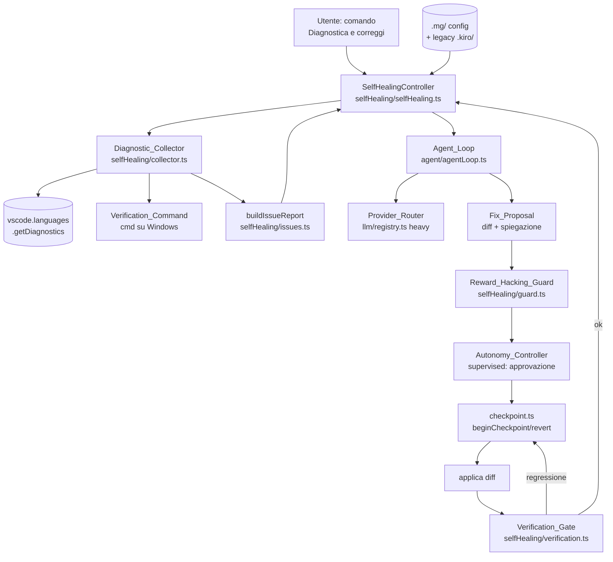
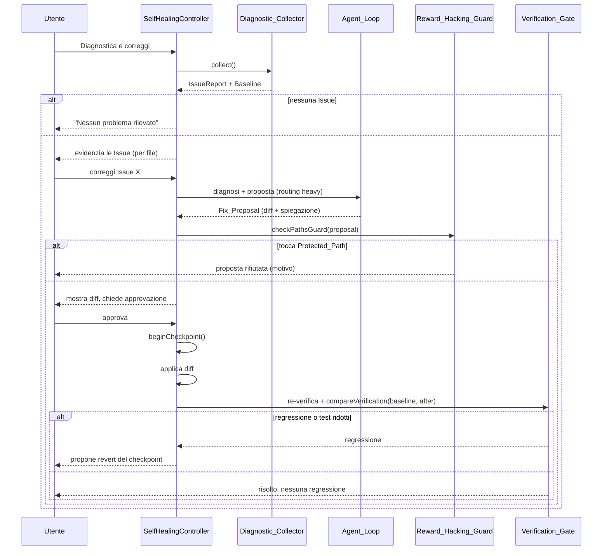

# Design: self-healing

## Overview

Questa funzionalità aggiunge a MGCoding una **autodiagnostica assistita** (Self_Healing di Livello 1): raccoglie gli errori di un progetto utente, li **evidenzia**, fa **proporre dal modello** una soluzione per ciascuno e — **solo dopo approvazione esplicita** — la applica in modo reversibile e verificato. È opt-in e a default disattivata; non modifica MGCoding stesso (solo i progetti utente).

Il design aggiunge cinque componenti, quattro dei quali a **nucleo puro** (testabili senza I/O), e riusa massicciamente l'infrastruttura esistente in `extensions/mgcoding/src/`:

1. **Diagnostic_Collector** — normalizza in `Issue` gli errori da diagnostiche LSP, build/typecheck, test e runtime (Req. 1).
2. **Issue_Report builder** — deduplica, categorizza e raggruppa per file le `Issue` per la presentazione (Req. 1, 2).
3. **Diagnosis/Proposal** — orchestra l'Agent_Loop per produrre `Diagnosis` e `Fix_Proposal` (diff + spiegazione), instradando su un modello capace (Req. 3).
4. **Verification_Gate** — ricalcola la verifica dopo l'applicazione e rileva regressioni rispetto alla `Baseline` (Req. 6).
5. **Reward_Hacking_Guard** + **budget tentativi** — impedisce fix che barano e ferma i cicli senza progresso (Req. 7, 8).

L'**approvazione** (Req. 4) e la **reversibilità** (Req. 5) non introducono nuovi meccanismi: riusano l'`Autonomy_Controller` in modalità `supervised` e il `checkpoint.ts` già esistenti. La selezione del modello per la diagnosi riusa il `Provider_Router`. Trasversale: Windows-first (verifica via `cmd`), prosa italiana / codice inglese, config sotto `.mg/` con legacy `.kiro/`, opt-in con default che preservano il comportamento (Req. 9).

### Principio di design trasversale: nucleo puro, guscio I/O

Come per `local-model-kiro-parity`, ogni componente è diviso in:
- una **logica pura** (nessun `vscode`/`fetch`/filesystem) che concentra le decisioni — dedup, confronto verifica, guardrail, budget — verificabile con property-based testing;
- un **guscio** che fa I/O (legge diagnostiche, esegue la verifica, applica il diff) e delega le decisioni al nucleo puro.

## Architecture



### Flusso di una correzione (per Issue)



### Responsabilità dei componenti

| Componente | File | Responsabilità | Requisiti |
|---|---|---|---|
| Issue model + report | `selfHealing/issues.ts` (nuovo, puro) | Dedup, categorizzazione, raggruppamento per file | 1.3, 1.4, 2.1, 2.2 |
| Verification compare | `selfHealing/verification.ts` (nuovo, puro) | Confronto snapshot vs Baseline, verdetto regressione | 6.2, 6.3 |
| Reward_Hacking_Guard | `selfHealing/guard.ts` (nuovo, puro) | Protected_Path, riduzione numero test | 7.1, 7.2, 7.3 |
| Budget tentativi | `selfHealing/budget.ts` (nuovo, puro) | Stop su budget esaurito / nessun progresso | 8.1, 8.2 |
| Proposal classify | `selfHealing/issues.ts` (puro) | Proposta valida vs non risolvibile | 3.2, 3.4 |
| Diagnostic_Collector | `selfHealing/collector.ts` (nuovo, guscio) | Raccolta diagnostiche + esecuzione Verification_Command | 1.1, 1.2, 1.5 |
| SelfHealingController | `selfHealing/selfHealing.ts` (nuovo, guscio) | Orchestrazione, comando, evidenziazione, gating | 2.3, 3.1, 3.3, 4, 5, 6.1, 8.3, 9 |
| Provider_Router | `llm/registry.ts` (riuso) | Routing heavy della diagnosi | 3.3 |
| Autonomy_Controller | `agent/autonomy.ts` (riuso) | Approvazione supervised | 4.1, 4.3 |
| Checkpoint | `edit/checkpoint.ts` (riuso) | Checkpoint/revert | 5.1, 5.2 |
| Config/migrazione | `util/mgConfig.ts` (riuso) | Lettura `.mg/` → `.kiro/` → default | 9.2, 9.3 |

## Components and Interfaces

### Issue model e report (`selfHealing/issues.ts`)

```typescript
export type IssueCategory = 'diagnostica' | 'build' | 'test' | 'runtime';

export interface Issue {
    category: IssueCategory;
    /** Percorso relativo alla radice del workspace, se noto. */
    file?: string;
    /** Riga 1-based, se nota. */
    line?: number;
    message: string;
    /** Origine: es. 'ts', 'eslint', 'vitest', 'tsc', 'run_command'. */
    source: string;
}

export interface FileGroup {
    /** '' per le Issue senza file (es. errori globali di build). */
    file: string;
    issues: Issue[];
}

export interface IssueReport {
    /** Issue deduplicate e ordinate in modo deterministico. */
    issues: Issue[];
    /** Stesse Issue raggruppate per file (Req. 2.2). */
    byFile: FileGroup[];
    total: number;
}

/**
 * Deduplica per chiave (category, file, line, message) preservando il primo arrivo
 * e mantenendo la categoria assegnata (Req. 1.3, 1.4).
 */
export function dedupeIssues(raw: readonly Issue[]): Issue[];

/**
 * Costruisce l'Issue_Report: dedup + ordinamento deterministico (per file, poi riga,
 * poi categoria, poi messaggio) + raggruppamento per file (Req. 2.1, 2.2).
 */
export function buildIssueReport(raw: readonly Issue[]): IssueReport;

export type ProposalStatus = 'proposed' | 'unresolved';

/**
 * Classifica una proposta del modello (Req. 3.2, 3.4):
 *  - 'proposed' se e solo se diff ed explanation sono entrambi non vuoti;
 *  - 'unresolved' altrimenti (la Issue è segnalata come non risolvibile automaticamente).
 */
export function classifyProposal(p: { diff?: string; explanation?: string }): ProposalStatus;
```

Il guscio `Diagnostic_Collector` mappa le `vscode.Diagnostic` di severità `Error` in `Issue{category:'diagnostica'}` e l'output del `Verification_Command` in `Issue{category:'build'|'test'}` con parser tolleranti (regex su righe tipo `error TS####`, `FAIL`, `✗`, ecc.). Gli errori runtime provengono dall'output di `run_command` fallito.

### Verification_Gate (`selfHealing/verification.ts`)

```typescript
export interface VerificationSnapshot {
    /** Errori di build/typecheck + diagnostiche di errore. */
    errorCount: number;
    /** Test rossi rilevati. */
    failingTests: number;
    /** Numero totale di test rilevati (per il guard anti-imbroglio). */
    totalTests: number;
}

export type RegressionVerdict = 'ok' | 'regression' | 'no-change';

/**
 * Confronta lo snapshot DOPO l'applicazione con la Baseline (Req. 6.2, 6.3):
 *  - 'regression' se errorCount aumenta OPPURE failingTests aumenta;
 *  - 'ok' se errorCount diminuisce E failingTests non aumenta (Issue mirata risolta senza danni);
 *  - 'no-change' altrimenti.
 * Funzione pura e totale: definita per qualunque coppia di snapshot.
 */
export function compareVerification(
    baseline: VerificationSnapshot,
    after: VerificationSnapshot
): RegressionVerdict;
```

Il guscio del gate esegue il `Verification_Command` (via `cmd` su Windows, Req. 9.4), ne estrae un `VerificationSnapshot` con lo stesso parser del collector, e invoca `compareVerification`. Su `regression` propone il `revertCheckpoint` (Req. 6.2); su `ok` riporta l'esito positivo (Req. 6.3).

### Reward_Hacking_Guard (`selfHealing/guard.ts`)

```typescript
export interface FixProposal {
    issue: Issue;
    diff: string;
    explanation: string;
    /** Percorsi modificati dal diff (relativi alla radice del workspace). */
    touchedPaths: string[];
}

export interface GuardConfig {
    /** Glob dei percorsi protetti: file di test e configurazioni di build/test. */
    protectedGlobs: string[];
}

export type GuardVerdict = { ok: true } | { ok: false; reason: string };

/** True se il percorso corrisponde a un Protected_Path (Req. 7.1). */
export function isProtectedPath(path: string, config: GuardConfig): boolean;

/**
 * Guard PRE-applicazione (Req. 7.2): rifiuta la proposta se uno qualunque dei
 * touchedPaths è un Protected_Path, indicandone il motivo.
 */
export function checkPathsGuard(proposal: FixProposal, config: GuardConfig): GuardVerdict;

/**
 * Guard POST-verifica (Req. 7.3): rifiuta se il numero totale di test è DIMINUITO
 * rispetto alla Baseline (after.totalTests < baseline.totalTests).
 */
export function checkTestCountGuard(
    baseline: VerificationSnapshot,
    after: VerificationSnapshot
): GuardVerdict;
```

`protectedGlobs` di default copre i pattern di test/config comuni (`**/*.test.*`, `**/*.spec.*`, `**/test/**`, `**/__tests__/**`, `vitest.config.*`, `jest.config.*`, `**/tsconfig*.json`, `.mocharc*`), configurabile via `mgcoding.selfHealing.protectedGlobs`.

### Budget tentativi (`selfHealing/budget.ts`)

```typescript
export interface AttemptState {
    attempts: number;       // tentativi già effettuati su questa Issue
    maxAttempts: number;    // da mgcoding.selfHealing.maxAttempts
    errorsBefore: number;   // errori prima dell'ultimo tentativo
    errorsAfter: number;    // errori dopo l'ultimo tentativo
}

export type AttemptDecision = 'continue' | 'stop-budget' | 'stop-no-progress';

/**
 * Decide se continuare a tentare su una Issue (Req. 8.1, 8.2):
 *  - 'stop-budget' se attempts >= maxAttempts;
 *  - altrimenti 'stop-no-progress' se errorsAfter >= errorsBefore (nessuna riduzione);
 *  - altrimenti 'continue'.
 */
export function decideAttempt(state: AttemptState): AttemptDecision;
```

### SelfHealingController (`selfHealing/selfHealing.ts`)

Guscio orchestratore. Espone il comando `mgcoding.selfHeal` («MGCoding: Diagnostica e correggi», Req. 9.1) e coordina il flusso: `collect` → evidenzia → per Issue: diagnosi (Agent_Loop, routing heavy) → `classifyProposal` → `checkPathsGuard` → approvazione (`Autonomy_Controller` supervised) → `beginCheckpoint` → applica → `Verification_Gate` + `checkTestCountGuard` → su regressione propone revert; `decideAttempt` governa i ritentativi. Legge la config con `readFeatureConfig` (`.mg/` → `.kiro/` → default, Req. 9.2, 9.3) e, se `mgcoding.selfHealing.enabled` è assente/falso, non fa nulla (Req. 9.2). Il `Verification_Command` riusa il rilevamento automatico di `mgcoding.spec.verifyAfterTask`.

## Data Models

### Nuovi Config_Key (namespace `mgcoding`)

| Config_Key | Tipo | Default | Requisito |
|---|---|---|---|
| `mgcoding.selfHealing.enabled` | boolean | `false` | 9.2 |
| `mgcoding.selfHealing.maxAttempts` | number | `2` | 8.3 |
| `mgcoding.selfHealing.verifyCommand` | string | `""` (auto-detect) | 1.2, 6.1 |
| `mgcoding.selfHealing.protectedGlobs` | string[] | pattern test/config | 7.1 |

I default preservano il comportamento esistente (Req. 9.2): con `enabled=false` la funzionalità è inerte. `verifyCommand=""` riusa l'auto-rilevamento già presente per le Spec.

### Tipi di dominio (riepilogo)

```typescript
type IssueCategory = 'diagnostica' | 'build' | 'test' | 'runtime';
type RegressionVerdict = 'ok' | 'regression' | 'no-change';
type AttemptDecision = 'continue' | 'stop-budget' | 'stop-no-progress';
type ProposalStatus = 'proposed' | 'unresolved';
type GuardVerdict = { ok: true } | { ok: false; reason: string };

interface Issue { category: IssueCategory; file?: string; line?: number; message: string; source: string; }
interface VerificationSnapshot { errorCount: number; failingTests: number; totalTests: number; }
interface FixProposal { issue: Issue; diff: string; explanation: string; touchedPaths: string[]; }
```

### Riuso esplicito (nessuna nuova implementazione)

- **Approvazione** (Req. 4): `decideAction('supervised', …).requiresApproval === true` dell'`Autonomy_Controller`.
- **Checkpoint/revert** (Req. 5): `beginCheckpoint`/`recordOriginal`/`revertCheckpoint` di `edit/checkpoint.ts`.
- **Routing heavy** (Req. 3.3): `chooseProvider(..., { complexity: 'heavy', requiredTier })` di `llm/registry.ts`.
- **Config precedence** (Req. 9.3): `readFeatureConfig`/`writeFeatureConfig` di `util/mgConfig.ts`.

## Correctness Properties

*Una proprietà è un'affermazione formale, universalmente quantificata, su cosa il sistema debba fare in ogni esecuzione valida. Le proprietà fanno da ponte tra i requisiti leggibili e le garanzie verificabili dalla macchina.* Ogni proprietà è coperta da **un singolo** property-based test (`fast-check`, ≥ 100 iterazioni).

### Property 1: Dedup deterministica e categorizzata delle Issue

*Per ogni* lista di `Issue`, `dedupeIssues` restituisce una lista senza due elementi con la stessa chiave `(category, file, line, message)`, preserva l'ordine di prima comparsa e non altera la categoria di alcuna Issue; applicarla due volte dà lo stesso risultato (idempotenza).

**Validates: Requirements 1.3, 1.4**

### Property 2: L'Issue_Report è raggruppato per file e coerente col totale

*Per ogni* lista di `Issue`, in `buildIssueReport` ogni Issue compare in esattamente un `FileGroup` (quello del suo `file`, o `''` se assente), l'unione dei gruppi è uguale a `issues`, `total === issues.length` e l'ordinamento è deterministico (stessa input → stesso output).

**Validates: Requirements 2.1, 2.2**

### Property 3: Classificazione della proposta in funzione di diff e spiegazione

*Per ogni* coppia `(diff, explanation)`, `classifyProposal` restituisce `'proposed'` se e solo se entrambi sono non vuoti (dopo trim), altrimenti `'unresolved'`.

**Validates: Requirements 3.2, 3.4**

### Property 4: Semantica del verdetto di regressione

*Per ogni* coppia di `VerificationSnapshot` `(baseline, after)`, `compareVerification` restituisce `'regression'` se `after.errorCount > baseline.errorCount` oppure `after.failingTests > baseline.failingTests`; restituisce `'ok'` se `after.errorCount < baseline.errorCount` e `after.failingTests ≤ baseline.failingTests`; `'no-change'` in ogni altro caso. La funzione è totale (definita per qualunque coppia).

**Validates: Requirements 6.2, 6.3**

### Property 5: Il guard rifiuta le proposte che toccano Protected_Path

*Per ogni* `FixProposal` e `GuardConfig`, `checkPathsGuard` restituisce `{ok:false}` se e solo se almeno uno dei `touchedPaths` soddisfa `isProtectedPath`; in caso di rifiuto il `reason` è non vuoto.

**Validates: Requirements 7.1, 7.2**

### Property 6: Il guard rifiuta la riduzione del numero di test

*Per ogni* coppia di `VerificationSnapshot` `(baseline, after)`, `checkTestCountGuard` restituisce `{ok:false}` se e solo se `after.totalTests < baseline.totalTests`.

**Validates: Requirements 7.3**

### Property 7: Budget dei tentativi e arresto sull'assenza di progresso

*Per ogni* `AttemptState`, `decideAttempt` restituisce `'stop-budget'` se `attempts ≥ maxAttempts`; altrimenti `'stop-no-progress'` se `errorsAfter ≥ errorsBefore`; altrimenti `'continue'`. (Priorità del budget sul progresso.)

**Validates: Requirements 8.1, 8.2**

### Proprietà riusate (verificate in `local-model-kiro-parity`)

Questi requisiti sono soddisfatti riusando componenti già implementati e testati; non si re-implementa la logica:

- **Req. 4.1, 4.3** (approvazione supervised) → *Property 13* di `local-model-kiro-parity` (`decideAction('supervised', …).requiresApproval === true`).
- **Req. 5.1, 5.2** (checkpoint/revert) → *Property 17* (`revertCheckpoint` riporta i file all'originale).
- **Req. 9.3** (precedenza `.mg/` → `.kiro/` → default) → *Property 28* (`readFeatureConfig`).

## Error Handling

| Condizione | Rilevazione | Comportamento | Requisito |
|---|---|---|---|
| Nessun errore rilevato | report vuoto | Informa l'utente e termina senza proporre modifiche | 1.5 |
| Verification_Command assente | auto-detect vuoto | Procede con le sole diagnostiche LSP; nessuna baseline test | 1.2, 6.1 |
| Modello non produce una fix | `classifyProposal === 'unresolved'` | Segnala la Issue come non risolta, prosegue con le altre | 3.4 |
| Proposta tocca Protected_Path | `checkPathsGuard` | Rifiuta con motivo, non applica | 7.2 |
| Regressione post-applicazione | `compareVerification === 'regression'` | Propone il revert del checkpoint | 6.2 |
| Riduzione test post-verifica | `checkTestCountGuard` | Rifiuta/propone revert | 7.3 |
| Nessun progresso o budget esaurito | `decideAttempt` | Interrompe i tentativi e chiede all'utente | 8.2 |

Principi: nessun fallimento silenzioso; in dubbio si **chiede conferma** e non si applica nulla (fail-safe verso il "non modificare"); ogni applicazione è sempre dentro un checkpoint per garantire la reversibilità.

## Testing Strategy

Approccio duale, coerente con `local-model-kiro-parity`: **property-based** per il nucleo puro, **unit/integration** per esempi e wiring.

### Test property-based (uno per proprietà, ≥ 100 iterazioni, `fast-check`)

- `selfHealDedup.pbt.test.ts` — Property 1 (dedup).
- `issueReport.pbt.test.ts` — Property 2 (raggruppamento/totale).
- `proposalClassify.pbt.test.ts` — Property 3 (proposta valida/non risolvibile).
- `verificationCompare.pbt.test.ts` — Property 4 (verdetto regressione).
- `guardProtectedPath.pbt.test.ts` — Property 5 (path protetti).
- `guardTestCount.pbt.test.ts` — Property 6 (riduzione test).
- `attemptBudget.pbt.test.ts` — Property 7 (budget/no-progress).

Ogni test annotato: `// Feature: self-healing, Property {n}: {testo}`.

### Test unit/integration

- Parsing dell'output di verifica (tsc/vitest) in `VerificationSnapshot` (esempi reali, edge: 0 test, output rumoroso).
- Mapping `vscode.Diagnostic` (Error) → `Issue` con `test/vscodeStub.ts`.
- Comando `mgcoding.selfHeal` no-op quando `enabled=false` (Req. 9.2).
- Esecuzione del `Verification_Command` via `cmd` su Windows (Req. 9.4), con mock di `child_process` (pattern di `ollamaUnreachableWinShell.int.test.ts`).
- Flusso end-to-end con provider/verifica finti: Issue → proposta → guard → (approvazione finta) → checkpoint → verifica → esito, incluso il ramo regressione → revert.

### Note di esecuzione

- I test girano in modalità singola (`npm test` → `scripts/run-tests.mjs`), mai in watch.
- I componenti puri non importano `vscode`; i gusci usano `test/vscodeStub.ts` e `loadAfterMock` per i moduli che leggono `vscode` a load-time.
